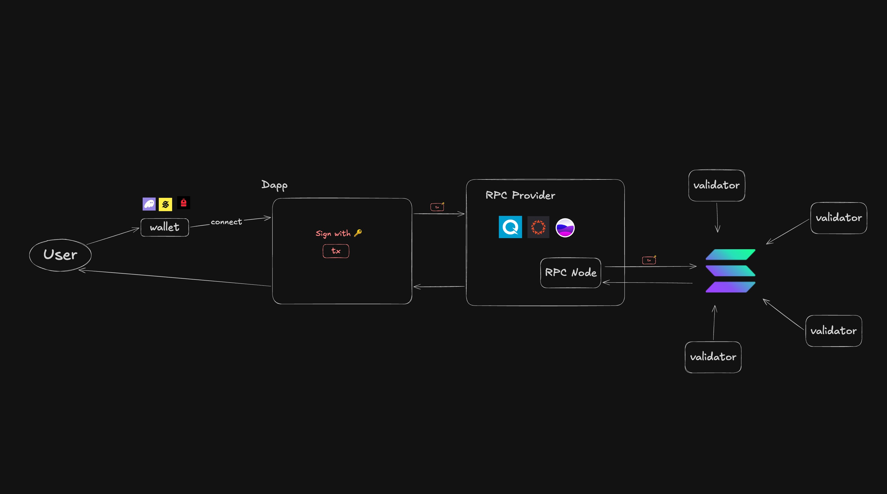
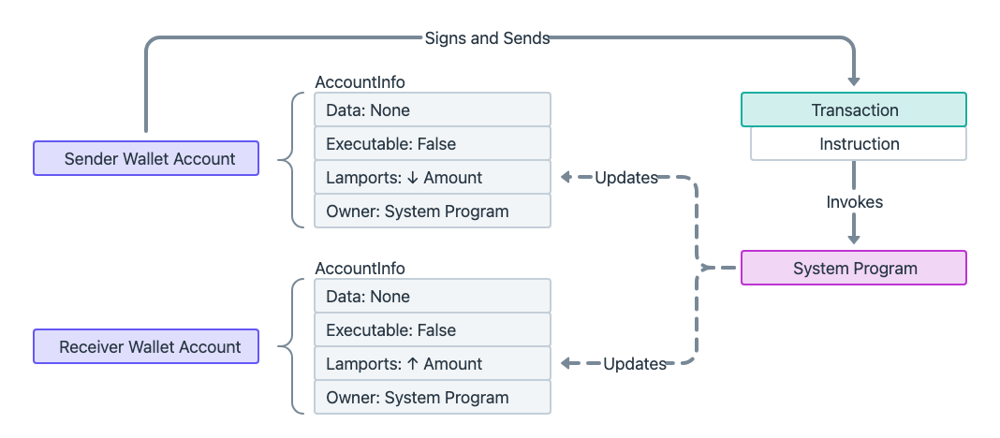
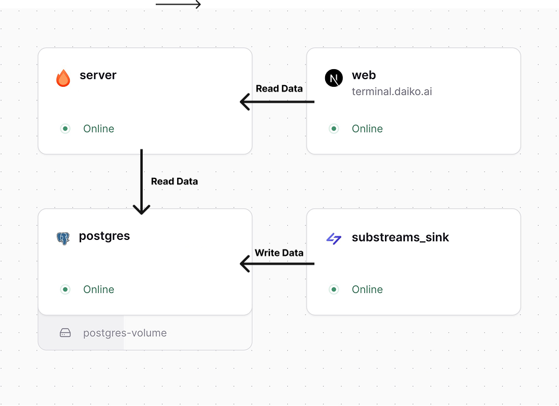

# フロントエンドとの繋ぎこみ（第４章）

[Solana Developer Bootcamp 2026 🇯🇵](https://luma.com/7c9i3woj)

---

### 自己紹介

<div class="grid grid-cols-2 gap-x-14 gap-y-6 items-center w-full max-w-full mx-auto mt-8 mb-4 px-6 box-border">

<div class="flex justify-center items-center min-w-0 pr-2">


</div>

<div class="min-w-0 pl-4 pr-2 text-left text-2xl leading-relaxed tracking-tight">

- Name: **asuma**
- Role: **Co-Founder / CTO @DaikoAI**
- X: [@0xasuma_jp]()
- Github: [@posaune0423]()
- Linkedin: [@posaune0423]()

</div>

</div>

<!-- header: "" -->

---

### 講義内容

#### フロントエンドからブロックチェーンまでのデータの流れ

#### フロントエンド実装での注意点

#### よくある追加実装

#### まとめ

---

### フロントエンドからブロックチェーンまでのデータの流れ

#### 1. Wallet Connect & sign tx

#### 2. txの組み立て & RPCへ送信

#### 3. RPC送信以降の流れ

<!-- header: フロントエンドからブロックチェーンまでのデータの流れ -->

---

### 全体像



---

### 1. Wallet Connect & sign tx

```tsx
function ConnectButton() {
  const { connectors, connect } = useWalletConnection()

  return (
    <div>
      {connectors.map((connector) => (
        <button key={connector.id} onClick={() => connect(connector.id)}>
          Connect {connector.name}
        </button>
      ))}
    </div>
  )
}
```

---

### 2. txの組み立て & RPCへ送信

```tsx
import { clusterApiUrl, Connection, PublicKey } from '@solana/web3.js'
import { Program } from '@anchor-lang/core'
import type { HelloAnchor } from './idlType'
import idl from './idl.json'

const connection = new Connection(clusterApiUrl('devnet'), 'confirmed')

export const program = new Program(idl as HelloAnchor, {
  connection,
})
```

---

### 2. txの組み立て & RPCへ送信

invokeしたいprogramのinstructionを指定し `.rpc()`で組み立てたtxをそのままsubmitできる

```tsx
await program.methods
  .instructionName(instructionData)
  .accounts({})
  .signers([])
  .rpc()
```

---

### 3. RPC送信以降の流れ



---

### 3. RPC送信以降の流れ

1. RPC Nodeがuserから受け取ったsigned txをleader scheduleに従ってcurrent leader nodeに投げる
2. Leader Nodeがtxを並列処理
3. program invokeによりaccountのstateが変化
   - solのtransferであれば単にlamports残高が変化
   - spl tokenのtransferであればdata account(ATA)のamountが変化
4. Leader Nodeがblock生成し他validatorにbroadcast

---

<!-- header: '' -->

## フロントエンド実装での注意点

#### 1. 推奨libとlegacy lib

#### 2. 非同期状態管理

#### 3. error handling

---

<!-- header: フロントエンド実装での注意点 -->

### 1. 推奨libとlegacy lib

**Latest**
`@solana/client`, `@solana/react-hooks`

**Legacy**
`@solana/web3.js`

※とはいえ、結構いろんなsdkやlibがまだlegacyなweb3.jsに依存している状況

---

### 2. 非同期状態管理

Web3のfrontendは扱う状態が多い

- walletの`connect` / `disconnect`
- tx送信のstatus(`isSending`)
- アカウントデータのfetch・subscribe

---


---

### 3. error handling

rpc独自のエラーとdomain logicに関するエラーは分けて管理するべき。

基本的なrpc周りのerrorは`@solana/errors`というlibがまとめてくれている。

---

### 3. error handling

代表的なrpc error

<div class="text-sm">

| Code     | Message                           | Explanation                                                                            |
| -------- | --------------------------------- | -------------------------------------------------------------------------------------- |
| `-32001` | Block Cleaned Up                  | システムアップグレードに関連する問題の可能性があります。運用元にお問い合わせください。 |
| `-32002` | Transaction simulation failed     | 多くの場合、無効な命令やパラメータ、あるいはblockhashが原因です。                      |
| `-32003` | Signature verification failure    | 署名が誤っている、もしくは不足している場合によく発生します。                           |
| `-32004` | Block not available for slot      | 一時的なエラーです。リトライを推奨します。                                             |
| `-32005` | Node is unhealthy                 | ノードの遅延が原因です。ノードを変更するか、リトライしてください。                     |
| `-32007` | Slot skipped or missing           | リクエストしたブロックが存在しません。Solana Explorerなどで確認してください。          |
| `-32009` | Slot missing in long-term storage | 履歴ブロックデータが利用できません。                                                   |
| `-32010` | Excluded from account indexes     | 無効なペイロード、または未サポートのRPCメソッドです。                                  |
| `-32013` | Signature length mismatch         | 署名の形式が正しくありません。                                                         |

</div>

---

### 3. error handling

```ts
import { SOLANA_ERROR__TRANSACTION__MISSING_SIGNATURE, SOLANA_ERROR__TRANSACTION__FEE_PAYER_SIGNATURE_MISSING, isSolanaError } from '@solana/errors'
import { assertIsFullySignedTransaction,getSignatureFromTransaction } from '@solana/transactions'

try {
  const transactionSignature = getSignatureFromTransaction(tx)
  assertIsFullySignedTransaction(tx)Ï
  /* ... */
} catch (e) {
  if (isSolanaError(e, SOLANA_ERROR__TRANSACTION__SIGNATURES_MISSING)) {
    displayError(
      "We can't send this transaction without signatures for these addresses:\n- %s",
      // The type of the `context` object is now refined to contain `addresses`.
      e.context.addresses.join('\n- '),
    )
    return
  } else if (
    isSolanaError(e, SOLANA_ERROR__TRANSACTION__FEE_PAYER_SIGNATURE_MISSING)
  ) {
    if (!tx.feePayer) {
      displayError('Choose a fee payer for this transaction before sending it')
    } else {
      displayError('The fee payer still needs to sign for this transaction')
    }
    return
  }
  throw e
}
```

---

### セキュリティ

a. Drift Protocolのハックとか鍵管理周りの話

---

<!-- header: '' -->

## よくある追加実装

#### 1.payerを使ったgasless tx

#### 2. indexerを使用したデータの集計、読み取り

---

<!-- header: よくある追加実装 -->

## 1. payerを使ったgasless tx

---

<!-- header: payerを使ったgasless tx -->

Solanaは複数署名者・複数権限者を前提にした transaction model.

`setTransactionMessageFeePayer(PLACEHOLDER_FEE_PAYER, tx)`などで`payer`を指定する事でsenderとpayerを分離してgas sponcerをnativeに実現可能

---

Alchemyなどのサービスを使うと以下の様に実装できます

<div class="text-xl">

```ts
const { value: bh } = await rpc.getLatestBlockhash().send()

const msg = pipe(
  createTransactionMessage({ version: 0 }),
  (tx) =>
    setTransactionMessageFeePayer(
      address('Amh6quo1FcmL16Qmzdugzjq3Lv1zXzTW7ktswyLDzits'), // placeholder
      tx,
    ),
  (tx) => setTransactionMessageLifetimeUsingBlockhash(bh, tx),
  (tx) =>
    appendTransactionMessageInstructions(
      [
        getTransferSolInstruction({
          source: user,
          destination: address(process.env.RECIPIENT!),
          amount: lamports(1_000_000n),
        }),
      ],
      tx,
    ),
)
```

</div>

---


<div class="text-lg">

```ts
const sponsored = await fetch(rpcUrl, {
  method: 'POST',
  headers: { 'content-type': 'application/json' },
  body: JSON.stringify({
    jsonrpc: '2.0',
    id: 1,
    method: 'alchemy_requestFeePayer',
    params: [
      {
        policyId: process.env.ALCHEMY_POLICY_ID!,
        serializedTransaction: getBase64EncodedWireTransaction(
          compileTransaction(msg),
        ),
      },
    ],
  }),
})
  .then((r) => r.json())
  .then((r) => r.result.serializedTransaction)

const tx = getTransactionDecoder().decode(getBase64Decoder().decode(sponsored))
const signed = await partiallySignTransaction([user], tx)

await rpc
  .sendTransaction(getBase64EncodedWireTransaction(signed), {
    encoding: 'base64',
  })
  .send()
```

</div>

---

<!-- header: よくある追加実装 -->

## 2. indexerを使用したデータのクエリ・集計

---

<!-- header: indexerを使用したデータのクエリ・集計 -->

### そもそもindexerとは？

オンチェーン上のデータをrealtimeにsubscribe / 整形してapplicationに合わせたread modelとして永続化するservice

---

### どういう時にindexerが必要になるのか

- filter, searchなどonchain dataに対してqueryしたり集計が必要な場合
- 複数プロトコルや複数コントラクトのデータをaggregateしたい時
- DEXのchartなどの時系列データの整形・表示

---

[Substream]()というサービスを使うとgraphQLやSQlでデータを簡単にfilter / queryできるようになる



---

<!-- header: '' -->

## まとめ

---

<!-- header: まとめ -->


---

### フロントエンドからブロックチェーンまでのデータの流れ

#### 1. Wallet Connect & sign tx

#### 2. txの組み立て & RPCへ送信

#### 3. RPC送信以降の流れ

---

### フロントエンド実装での注意点

#### 1. 推奨libとlegacy lib

#### 2. 非同期状態管理

#### 3. error handling

---

### よくある追加実装

#### 1. payerを使ったgasless tx

#### 2. indexerを使用したデータのクエリ・集計

---

<!-- header: '' -->

### 参考文献・サービス

- [Substream](https://substreams.dev)
- [Alchemy](https://www.alchemy.com)
- [@solana/kit](https://github.com/anza-xyz/kit)
- [@solana/errors](https://github.com/anza-xyz/kit/tree/main/packages/errors)

- https://solana.com/docs/core/transactions/transaction-structure
- https://solana.com/docs/frontend
