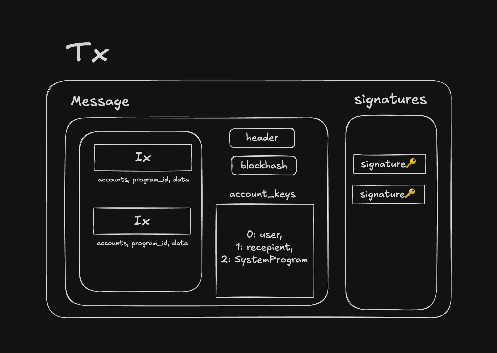
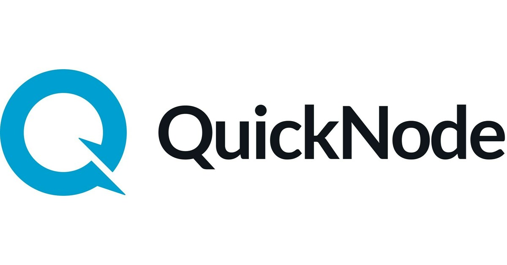

# フロントエンドとの繋ぎこみ（第４章）

[Solana Developer Bootcamp 2026 🇯🇵](https://luma.com/7c9i3woj)

---

### 自己紹介

<div class="grid grid-cols-2 gap-x-14 gap-y-6 items-center w-full max-w-full mx-auto mt-8 mb-4 px-6 box-border">

<div class="flex justify-center items-center min-w-0 pr-2">


</div>

<div class="min-w-0 pl-4 pr-2 text-left text-2xl leading-relaxed tracking-tight">

- Name: **asuma**
- Role: **Co-Founder / CTO [@DaikoAI](https://daiko.ai)**
- Links:
  - [posaune0423.com](https://posaune0423.com)
  - 𝕏: [@0xasuma_jp](https://x.com/0xasuma_jp)
  - Github: [@posaune0423](https://github.com/posaune0423)
  - Linkedin: [@posaune0423](https://linkedin.com/in/posaune0423)

</div>

</div>

<!-- header: "" -->

---

### 講義内容

#### フロントエンドからブロックチェーンまでのデータの流れ

#### フロントエンド実装での注意点

#### よくある追加実装

#### まとめ

---

### フロントエンドからブロックチェーンまでのデータの流れ

#### 1. Wallet Connect & sign tx

#### 2. txの組み立て & RPCへ送信

#### 3. RPC送信以降の流れ

<!-- header: フロントエンドからブロックチェーンまでのデータの流れ -->

---

### 全体像

<div class="text-center">


</div>

---

### 1. Wallet Connect & sign tx

```tsx
function ConnectButton() {
  const { connectors, connect } = useWalletConnection()

  return (
    <div>
      {connectors.map((connector) => (
        <button key={connector.id} onClick={() => connect(connector.id)}>
          Connect {connector.name}
        </button>
      ))}
    </div>
  )
}
```

---

**Solanaのtxの中身**

<div class="text-center">



</div>

---

### 2. txの組み立て & RPCへ送信

<div class="grid grid-cols-2 gap-x-10 items-center w-full max-w-full mx-auto mt-4 px-4 box-border">

<div class="min-w-0 pr-3 text-left text-lg leading-relaxed">

**RPC(Provider)の役割:**

BlockchainのNodeを運用しuserからの署名付きtxを受け取りblockchainに送信するapiなどを提供しているインフラ事業者

<!--
SWQoSなどを採用しているSolanaでは特にRPCの選定などは重要
gas priority feeなど以前にvalidator nodeのstake amountでもtx取り込みのpriorityが変わってくる
 -->

</div>

<div class="min-w-0 pl-2 flex items-center justify-center">

<div class="grid grid-cols-2 gap-y-10 items-stretch justify-items-center w-full max-w-sm mx-auto">

<div class="bg-white rounded-lg shadow-md border border-gray-200 p-3 flex items-center justify-center h-24 w-36 mx-auto box-border">


</div>

<div class="bg-white rounded-lg shadow-md border border-gray-200 p-3 flex items-center justify-center h-24 w-36 mx-auto box-border">



</div>

<div class="bg-white rounded-lg shadow-md border border-gray-200 p-3 flex items-center justify-center h-24 w-36 mx-auto box-border">


</div>

<div class="bg-white rounded-lg shadow-md border border-gray-200 p-3 flex items-center justify-center h-24 w-36 mx-auto box-border">


</div>

</div>

</div>

</div>

---

### 2. txの組み立て & RPCへ送信

`@anchor-lang/core`は現状solana/kit未support. 最新の`@solana/kit`でanchor programを型安全に使うには、

```bash
codama run js
```

などでanchor programのidlからinstruction生成codeなどを自動生成する事で`@solana/kit`でも型安全にanchor programを呼び出すことができます

---

### 2. txの組み立て & RPCへ送信

[codama]()でgenerateした関数でinstructionを生成し `prepareAndSend()`で組み立てたtxをsubmitできます

<div class="text-xl">

```tsx
import { useSendTransaction } from '@solana/react-hooks'

function SendPrepared({ instructions }) {
  const { prepareAndSend, isSending, status, signature, error } =
    useSendTransaction()
  return (
    <div>
      <button
        disabled={isSending}
        onClick={() => prepareAndSend({ instructions })}
      >
        {isSending ? 'Submitting…' : 'Send transaction'}
      </button>
      <p>Status: {status}</p>
      {signature ? <p>Signature: {signature}</p> : null}
      {error ? <p role="alert">{String(error)}</p> : null}
    </div>
  )
}
```

</div>

---

### 3. RPC送信以降の流れ

<div class="text-center">


</div>

---

### 3. RPC送信以降の流れ

1. RPC Nodeがuserから受け取ったsigned txをleader scheduleに従ってcurrent leader nodeに投げる
2. Leader Nodeがtxを並列処理
3. program invokeによりaccountのstateが変化
   - solのtransferであれば単にlamports残高が変化
   - spl tokenのtransferであればdata account(ATA)のamountが変化
4. Leader Nodeがblock生成し他validatorにbroadcast

---

<!-- header: '' -->

## フロントエンド実装での注意点

#### 1. 推奨libとlegacy lib

#### 2. RPCの冗長設計

#### 3. error handling

#### 4. セキュリティ

---

<!-- header: フロントエンド実装での注意点 -->

### 1. 推奨libとlegacy lib

<!--
reactなどで使う場合は基本的に`@solana/client`, `@solana/react-hooks`を使う
`@solana/kit`はそれらのlibの内部でも使われているより低レベルな実装
-->

**Latest ✅**
`@solana/client`, `@solana/react-hooks`, `@solana/kit`

**Legacy ❌**
`@solana/web3.js`

※とはいえ、結構いろんなsdkやlibがまだlegacyなweb3.jsに依存している状況

---

### 2. RPCの冗長設計

RPCサービスも完璧ではありません。AWSやCloudflareなどと同じ様にサービスがダウンすることもあるのであらかじめ冗長構成を取っておくのが本番環境では重要です。

<div class="text-lg">

```ts
import { RpcTransport } from '@solana/rpc-spec'
import { RpcResponse } from '@solana/rpc-spec-types'
import { createHttpTransport } from '@solana/rpc-transport-http'

// Create a transport for each RPC server
const transports = [
  createHttpTransport({ url: 'https://mainnet-beta.my-server-1.com' }),
  createHttpTransport({ url: 'https://mainnet-beta.my-server-2.com' }),
  createHttpTransport({ url: 'https://mainnet-beta.my-server-3.com' }),
]

// Create a wrapper transport that distributes requests to them
let nextTransport = 0
async function roundRobinTransport<TResponse>(
  ...args: Parameters<RpcTransport>
): Promise<RpcResponse<TResponse>> {
  const transport = transports[nextTransport]
  nextTransport = (nextTransport + 1) % transports.length
  return await transport(...args)
}
```

</div>

---

### 3. error handling

rpc独自のエラーとdomain logicに関するエラーは分けて管理するべき。

基本的なrpc周りのerrorは`@solana/errors`というlibがまとめてくれている。

---

### 3. error handling

代表的なrpc error

<div class="text-sm">

| Code     | Message                           | Explanation                                                                            |
| -------- | --------------------------------- | -------------------------------------------------------------------------------------- |
| `-32001` | Block Cleaned Up                  | システムアップグレードに関連する問題の可能性があります。運用元にお問い合わせください。 |
| `-32002` | Transaction simulation failed     | 多くの場合、無効な命令やパラメータ、あるいはblockhashが原因です。                      |
| `-32003` | Signature verification failure    | 署名が誤っている、もしくは不足している場合によく発生します。                           |
| `-32004` | Block not available for slot      | 一時的なエラーです。リトライを推奨します。                                             |
| `-32005` | Node is unhealthy                 | ノードの遅延が原因です。ノードを変更するか、リトライしてください。                     |
| `-32007` | Slot skipped or missing           | リクエストしたブロックが存在しません。Solana Explorerなどで確認してください。          |
| `-32009` | Slot missing in long-term storage | 履歴ブロックデータが利用できません。                                                   |
| `-32010` | Excluded from account indexes     | 無効なペイロード、または未サポートのRPCメソッドです。                                  |
| `-32013` | Signature length mismatch         | 署名の形式が正しくありません。                                                         |

</div>

---

### 3. error handling

```ts
import { SOLANA_ERROR__TRANSACTION__MISSING_SIGNATURE, SOLANA_ERROR__TRANSACTION__FEE_PAYER_SIGNATURE_MISSING, isSolanaError } from '@solana/errors'
import { assertIsFullySignedTransaction,getSignatureFromTransaction } from '@solana/transactions'

try {
  const transactionSignature = getSignatureFromTransaction(tx)
  assertIsFullySignedTransaction(tx)Ï
  /* ... */
} catch (e) {
  if (isSolanaError(e, SOLANA_ERROR__TRANSACTION__SIGNATURES_MISSING)) {
    displayError(
      "We can't send this transaction without signatures for these addresses:\n- %s",
      // The type of the `context` object is now refined to contain `addresses`.
      e.context.addresses.join('\n- '),
    )
    return
  } else if (
    isSolanaError(e, SOLANA_ERROR__TRANSACTION__FEE_PAYER_SIGNATURE_MISSING)
  ) {
    if (!tx.feePayer) {
      displayError('Choose a fee payer for this transaction before sending it')
    } else {
      displayError('The fee payer still needs to sign for this transaction')
    }
    return
  }
  throw e
}
```

---

### 4. セキュリティ

#### フロントエンド側のセキュリティ

<div class="grid grid-cols-3 gap-5 items-stretch w-full mt-6 text-lg leading-relaxed">

<div class="rounded-2xl overflow-hidden" style="background: rgba(12, 16, 28, 0.9); border: 1px solid rgba(255,255,255,0.12); box-shadow: 0 18px 40px rgba(0,0,0,0.22), inset 0 1px 0 rgba(255,255,255,0.04);">

<div style="height: 4px; background: linear-gradient(90deg, rgba(20,241,149,0.96), rgba(70,214,255,0.55));"></div>

<div class="px-5 py-5">

<div class="flex items-center justify-between mb-4 text-xs" style="letter-spacing: 0.14em; text-transform: uppercase; color: rgba(170,180,214,0.9);">

<span>Frontend Risk</span>
<span style="font-size: 1.05em; color: rgba(20,241,149,0.96);">01</span>

</div>

<div class="text-2xl font-semibold mb-3">Wallet Phishing</div>

<div class="mb-4 text-base leading-relaxed" style="color: rgba(170,180,214,0.92);">

「Mint」のつもりでも、別の命令に署名させられることがある

</div>

- confirm 画面だけで安全と判断しない
- UI で `Program ID` と instruction を明示する
- `Verified Builds` で本物の program か確認する

</div>

</div>

<div class="rounded-2xl overflow-hidden" style="background: rgba(14, 19, 31, 0.92); border: 1px solid rgba(255,255,255,0.12); box-shadow: 0 18px 40px rgba(0,0,0,0.22), inset 0 1px 0 rgba(255,255,255,0.04);">

<div style="height: 4px; background: linear-gradient(90deg, rgba(70,214,255,0.92), rgba(153,69,255,0.5));"></div>

<div class="px-5 py-5">

<div class="flex items-center justify-between mb-4 text-xs" style="letter-spacing: 0.14em; text-transform: uppercase; color: rgba(170,180,214,0.9);">

<span>Preflight Check</span>
<span style="font-size: 1.05em; color: rgba(70,214,255,0.92);">02</span>

</div>

<div class="text-2xl font-semibold mb-3">Transaction Simulation</div>

<div class="mb-4 text-base leading-relaxed" style="color: rgba(170,180,214,0.92);">

送信前に失敗や想定外の state change を見つけるための最終チェック

</div>

- `simulateTransaction` で事前確認する
- blockhash 切れや account 不足を先に潰せる
- 安全証明ではなく preflight に留まる

</div>

</div>

<div class="rounded-2xl overflow-hidden" style="background: rgba(16, 22, 36, 0.92); border: 1px solid rgba(255,255,255,0.12); box-shadow: 0 18px 40px rgba(0,0,0,0.22), inset 0 1px 0 rgba(255,255,255,0.04);">

<div style="height: 4px; background: linear-gradient(90deg, rgba(153,69,255,0.92), rgba(196,163,255,0.56));"></div>

<div class="px-5 py-5">

<div class="flex items-center justify-between mb-4 text-xs" style="letter-spacing: 0.14em; text-transform: uppercase; color: rgba(170,180,214,0.9);">

<span>Program Trust</span>
<span style="font-size: 1.05em; color: rgba(196,163,255,0.96);">03</span>

</div>

<div class="text-2xl font-semibold mb-3">Malicious Program</div>

<div class="mb-4 text-base leading-relaxed" style="color: rgba(170,180,214,0.92);">

想定外の `Program ID` を踏むと、正しい UI でも不正な binary を実行し得る

</div>

- 参照先 `Program ID` を固定して確認する
- unofficial fork や差し替え済み program を疑う
- `Verified Builds` で binary と公開ソースの対応を検証する

</div>

</div>

</div>

<div class="mt-5 px-5 py-4 rounded-2xl text-base leading-relaxed" style="background: rgba(10, 14, 24, 0.74); border: 1px solid rgba(255,255,255,0.1); color: rgba(170,180,214,0.92);">

フロントエンド側では「何を送るか」と「どこに送るか」をユーザーにも見える形で固定することが重要

</div>

---

### 4. セキュリティ

#### プログラム側のセキュリティ

<div class="grid grid-cols-3 gap-5 items-stretch w-full mt-6 text-lg leading-relaxed">

<div class="rounded-2xl overflow-hidden" style="background: rgba(12, 16, 28, 0.9); border: 1px solid rgba(255,255,255,0.12); box-shadow: 0 18px 40px rgba(0,0,0,0.22), inset 0 1px 0 rgba(255,255,255,0.04);">

<div style="height: 4px; background: linear-gradient(90deg, rgba(20,241,149,0.96), rgba(70,214,255,0.55));"></div>

<div class="px-5 py-5">

<div class="flex items-center justify-between mb-4 text-xs" style="letter-spacing: 0.14em; text-transform: uppercase; color: rgba(170,180,214,0.9);">

<span>Authority</span>
<span style="font-size: 1.05em; color: rgba(20,241,149,0.96);">01</span>

</div>

<div class="text-2xl font-semibold mb-3">Signer Check</div>

<div class="mb-4 text-base leading-relaxed" style="color: rgba(170,180,214,0.92);">

重要操作の呼び出し元が本当に権限者かを見る

</div>

- CPI でも signer 権限は勝手に増やせない
- `ctx.accounts.authority.is_signer`

</div>

</div>

<div class="rounded-2xl overflow-hidden" style="background: rgba(14, 19, 31, 0.92); border: 1px solid rgba(255,255,255,0.12); box-shadow: 0 18px 40px rgba(0,0,0,0.22), inset 0 1px 0 rgba(255,255,255,0.04);">

<div style="height: 4px; background: linear-gradient(90deg, rgba(70,214,255,0.92), rgba(153,69,255,0.5));"></div>

<div class="px-5 py-5">

<div class="flex items-center justify-between mb-4 text-xs" style="letter-spacing: 0.14em; text-transform: uppercase; color: rgba(170,180,214,0.9);">

<span>Ownership</span>
<span style="font-size: 1.05em; color: rgba(70,214,255,0.92);">02</span>

</div>

<div class="text-2xl font-semibold mb-3">Account Ownership</div>

<div class="mb-4 text-base leading-relaxed" style="color: rgba(170,180,214,0.92);">

渡された account が自分の program 管理下かを見る

</div>

- `owner` が違えば data は安全に更新できない
- `account.owner == program_id`

</div>

</div>

<div class="rounded-2xl overflow-hidden" style="background: rgba(16, 22, 36, 0.92); border: 1px solid rgba(255,255,255,0.12); box-shadow: 0 18px 40px rgba(0,0,0,0.22), inset 0 1px 0 rgba(255,255,255,0.04);">

<div style="height: 4px; background: linear-gradient(90deg, rgba(153,69,255,0.92), rgba(196,163,255,0.56));"></div>

<div class="px-5 py-5">

<div class="flex items-center justify-between mb-4 text-xs" style="letter-spacing: 0.14em; text-transform: uppercase; color: rgba(170,180,214,0.9);">

<span>Derivation</span>
<span style="font-size: 1.05em; color: rgba(196,163,255,0.96);">03</span>

</div>

<div class="text-2xl font-semibold mb-3">PDA Validation</div>

<div class="mb-4 text-base leading-relaxed" style="color: rgba(170,180,214,0.92);">

正しい seeds から導出した address かを見る

</div>

- `signer` `owner` `PDA再導出` をセットで確認する
- `require_keys_eq!(authority, expected_authority)`

</div>

</div>

</div>

<div class="mt-5 px-5 py-4 rounded-2xl text-base leading-relaxed" style="background: rgba(10, 14, 24, 0.74); border: 1px solid rgba(255,255,255,0.1); color: rgba(170,180,214,0.92);">

単独の check では不十分で、権限者・所有者・導出元の 3 方向から同時に締める必要がある

</div>

---

### 4. セキュリティ

#### 3点セットで守る

「何を守っているのか」を意識した 3 点セット

<div class="grid grid-cols-3 gap-5 items-stretch w-full mt-6 text-center text-lg leading-relaxed">

<div class="rounded-2xl overflow-hidden" style="background: rgba(12, 16, 28, 0.9); border: 1px solid rgba(255,255,255,0.12); box-shadow: 0 18px 40px rgba(0,0,0,0.22), inset 0 1px 0 rgba(255,255,255,0.04);">

<div style="height: 4px; background: linear-gradient(90deg, rgba(20,241,149,0.96), rgba(70,214,255,0.55));"></div>

<div class="px-5 py-6">

<div class="text-5xl font-bold mb-3" style="color: rgba(20,241,149,0.96);">1</div>

<div class="text-2xl font-semibold mb-3">署名確認</div>

<div style="color: rgba(170,180,214,0.92);">本当に権限のある人物か？</div>

</div>

</div>

<div class="rounded-2xl overflow-hidden" style="background: rgba(14, 19, 31, 0.92); border: 1px solid rgba(255,255,255,0.12); box-shadow: 0 18px 40px rgba(0,0,0,0.22), inset 0 1px 0 rgba(255,255,255,0.04);">

<div style="height: 4px; background: linear-gradient(90deg, rgba(70,214,255,0.92), rgba(153,69,255,0.5));"></div>

<div class="px-5 py-6">

<div class="text-5xl font-bold mb-3" style="color: rgba(70,214,255,0.92);">2</div>

<div class="text-2xl font-semibold mb-3">Owner確認</div>

<div style="color: rgba(170,180,214,0.92);">この account は自分の program か？</div>

</div>

</div>

<div class="rounded-2xl overflow-hidden" style="background: rgba(16, 22, 36, 0.92); border: 1px solid rgba(255,255,255,0.12); box-shadow: 0 18px 40px rgba(0,0,0,0.22), inset 0 1px 0 rgba(255,255,255,0.04);">

<div style="height: 4px; background: linear-gradient(90deg, rgba(153,69,255,0.92), rgba(196,163,255,0.56));"></div>

<div class="px-5 py-6">

<div class="text-5xl font-bold mb-3" style="color: rgba(196,163,255,0.96);">3</div>

<div class="text-2xl font-semibold mb-3">PDA再導出確認</div>

<div style="color: rgba(170,180,214,0.92);">seeds から導出した address と一致するか？</div>

</div>

</div>

</div>

<div class="mt-6 rounded-2xl px-6 py-4 text-lg leading-relaxed" style="background: rgba(10, 14, 24, 0.82); border: 1px solid rgba(255,255,255,0.12);">

**この 3 つを怠ると**

- 攻撃者が意図しない account を差し込める
- 権限のない操作を実行できる余地が生まれる

</div>

---

<!-- header: '' -->

## よくある追加実装

---

### よくある追加実装

#### 1.payerを使ったgasless tx

#### 2. indexerを使用したデータの集計、読み取り

---

<!-- header: よくある追加実装 -->

## 1. payerを使ったgasless tx

---

<!-- header: payerを使ったgasless tx -->

Solanaは複数署名者・複数権限者を前提にした transaction model.

`setTransactionMessageFeePayer(PLACEHOLDER_FEE_PAYER, tx)`などで`payer`を指定する事でsenderとpayerを分離してgas sponcerをnativeに実現可能

---

Alchemyなどのサービスを使うと以下の様に実装できます

<div class="text-xl">

```ts
const { value: bh } = await rpc.getLatestBlockhash().send()

const msg = pipe(
  createTransactionMessage({ version: 0 }),
  (tx) =>
    setTransactionMessageFeePayer(
      address('Amh6quo1FcmL16Qmzdugzjq3Lv1zXzTW7ktswyLDzits'), // placeholder
      tx,
    ),
  (tx) => setTransactionMessageLifetimeUsingBlockhash(bh, tx),
  (tx) =>
    appendTransactionMessageInstructions(
      [
        getTransferSolInstruction({
          source: user,
          destination: address(process.env.RECIPIENT!),
          amount: lamports(1_000_000n),
        }),
      ],
      tx,
    ),
)
```

</div>

---

<div class="text-lg">

```ts
const sponsored = await fetch(rpcUrl, {
  method: 'POST',
  headers: { 'content-type': 'application/json' },
  body: JSON.stringify({
    jsonrpc: '2.0',
    id: 1,
    method: 'alchemy_requestFeePayer',
    params: [
      {
        policyId: process.env.ALCHEMY_POLICY_ID!,
        serializedTransaction: getBase64EncodedWireTransaction(
          compileTransaction(msg),
        ),
      },
    ],
  }),
})
  .then((r) => r.json())
  .then((r) => r.result.serializedTransaction)

const tx = getTransactionDecoder().decode(getBase64Decoder().decode(sponsored))
const signed = await partiallySignTransaction([user], tx)

await rpc
  .sendTransaction(getBase64EncodedWireTransaction(signed), {
    encoding: 'base64',
  })
  .send()
```

</div>

---

<!-- header: よくある追加実装 -->

## 2. indexerを使用したデータのクエリ・集計

---

<!-- header: indexerを使用したデータのクエリ・集計 -->

### そもそもindexerとは？

オンチェーン上のデータをrealtimeにsubscribe / 整形してapplicationに合わせたread modelとして永続化するservice

---

### どういう時にindexerが必要になるのか

- filter, searchなどonchain dataに対してqueryしたり集計が必要な場合
- 複数プロトコルや複数コントラクトのデータをaggregateしたい時
- DEXのchartなどの時系列データの整形・表示

---

[Substream]()というサービスを使うとgraphQLやSQlでデータを簡単にfilter / queryできるようになる


---

<!-- header: '' -->

## まとめ

---

<!-- header: まとめ -->

<div class="text-center">


</div>

---

### フロントエンドからブロックチェーンまでのデータの流れ

#### 1. Wallet Connect & sign tx

#### 2. txの組み立て & RPCへ送信

#### 3. RPC送信以降の流れ

---

### フロントエンド実装での注意点

#### 1. 推奨libとlegacy lib

#### 2. RPCの冗長設計

#### 3. error handling

#### 4. セキュリティ

---

### よくある追加実装

#### 1. payerを使ったgasless tx

#### 2. indexerを使用したデータのクエリ・集計

---

<!-- header: '' -->

<div class="text-center">

# Thank you for listening

</div>

---

### 参考文献・サービス

- [Substream](https://substreams.dev)
- [Alchemy](https://www.alchemy.com)
- [@solana/kit](https://github.com/anza-xyz/kit)
- [@solana/errors](https://github.com/anza-xyz/kit/tree/main/packages/errors)

- https://solana.com/docs/core/transactions/transaction-structure
- https://solana.com/docs/frontend
- https://www.youtube.com/watch?v=2T3DOMv7iR4
